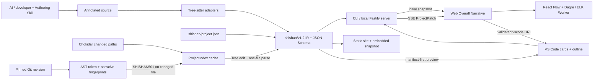

# ShiShan

ShiShan 是一套“代码叙事协议 + 本地解析器 + Web 可视化工具”。AI 在写代码时留下结构化自然语言说明，ShiShan 用真实 AST 校验这些说明绑定到哪个函数、分支、循环或具体语句，再把结果展示成可逐层展开的流程图。

当前分支已经实现 PRD 的 Phase 0–3D 技术基线，支持：

- Python；
- C++；
- TypeScript 与 TSX；
- JavaScript 与 JSX；
- `function`、`step`、`branch`、`loop`、`call`、`error`、`async` 主流程节点；
- 默认隐藏、按需展开的 `detail` 实现细节；
- CLI 扫描、校验、JSON 导出和本地 Web 服务；
- 文件级监听、Tree-sitter 增量解析和 SSE 差量补丁；
- 基于固定 Git revision 的疑似过期叙事检测；
- 不依赖 ShiShan API 的只读静态站点导出；
- 80 节点以上动态启用 ELK Worker、600 节点上限和超时回退的大图布局；
- `.shishan/project.json` 项目级叙事清单：命名整体流程、显式语义边并绑定真实源码符号；
- 默认展示项目整体流程图，函数/文件视图作为可下钻的第二层；
- 项目节点内的“概览 → 函数流程 → 实现细节”三级渐进披露，细节项继续绑定真实源码范围；
- 项目图在宽屏按左右总览，在窄屏按上下阅读并从入口保持可读缩放，同时保留 Overview/Functions 与命名流程切换；
- Web 界面中英文切换，并记住本地选择；作者写入的叙事正文保持原文，不做不可靠的自动翻译；
- 可打包安装的 Linux VS Code 扩展，提供 Activity Bar 卡片式节点预览、三级展开、项目大纲、Web 启动、严格检查和源码跳转；
- 既有代码的人工审核批量注释计划，默认 dry-run；
- 可独立安装的 ShiShan Authoring Skill。

当前交付和 CI 只面向 Linux。macOS、Windows 与多 AI 平台 Skill 已明确延期。

## 快速体验

需要 Node.js 24。

```bash
npm ci
npm run build
node apps/cli/dist/main.js scan fixtures/polyglot
node apps/cli/dist/main.js check fixtures/polyglot --strict
node apps/cli/dist/main.js serve fixtures/polyglot
```

浏览器打开 [http://127.0.0.1:4173](http://127.0.0.1:4173)。页面首次获取完整项目快照，之后只接收发生变化的文件补丁。

在 Git 仓库中，`scan`、`check`、`export` 和 `serve` 默认与 `HEAD` 比较。如果函数实现 token 发生变化而对应叙事完全没变，会报告 `SHISHAN501`。可以用 `--base origin/main` 指定评审基线，或用 `--no-freshness` 关闭。

## 注释长什么样

```python
# @shishan function calculate-order
# @summary Calculate a normalized order total
# @input raw item prices
# @output discounted total
def calculate_order(prices):
    # @shishan detail normalize-prices
    # @summary Materialize prices and calculate the subtotal
    # @covers statements=2
    prices = list(prices)
    total = sum(prices)

    # @shishan branch apply-discount
    # @summary Apply a discount to sufficiently large orders
    # @condition total is at least 100
    if total >= 100:
        total *= 0.9

    # @shishan step return-total
    # @summary Return the final numeric total
    return total
```

`detail` 默认绑定下一条 AST 语句。`@covers statements=2` 表示连续两条同层语句；它会作为函数或流程节点上的实现说明出现，不会制造新的流程节点或边。

`call`、`error`、`async` 会分别校验真实调用、异常边界和等待/协程语法；awaited call 应写成一个 `async` 节点，并可用 `@target` 保留调用目标。四语言完整样例见 [fixtures/advanced](fixtures/advanced)。

完整规范见 [docs/protocol.md](docs/protocol.md)，四语言可运行样例见 [fixtures/polyglot](fixtures/polyglot)。

项目整体叙事放在可提交 Git 的 `.shishan/project.json`。它只描述少量、人需要理解的命名流程，不自动把所有文件拼成不可读的依赖图；节点可用 `{ "path": "...", "symbol": "..." }` 绑定源码，解析器会验证路径、符号和拓扑。ShiShan 仓库本身已经用 [根项目清单](.shishan/project.json) 描述代码叙事管道和 Overview 交付链路；更小的四语言示例见 [fixtures/polyglot/.shishan/project.json](fixtures/polyglot/.shishan/project.json)。

## CLI

| 命令 | 作用 |
| --- | --- |
| `shishan init [root]` | 创建默认 `.shishanrc.json`，已有文件不会覆盖 |
| `shishan scan [root] [--json]` | 扫描项目并输出覆盖率、诊断和解析统计 |
| `shishan check [root] [--strict] [--base HEAD]` | 校验语法、绑定和 Git freshness；`--strict` 将 warning 作为失败 |
| `shishan export [root] [--out file] [--base HEAD]` | 导出带 freshness 诊断、符合 JSON Schema 的完整 IR |
| `shishan serve [root] [--port 4173] [--base HEAD]` | 启动仅监听 loopback 的本地 Web 服务和增量监听 |
| `shishan export-site [root] [--out directory]` | 导出静态站点；默认不含源码，`--include-source` 显式打包源码 |
| `shishan annotate-plan [root] [--out path]` | 为无叙事函数生成 summary 为空、status 为 draft 的人工审核计划 |
| `shishan annotate-apply [root] [--plan path] [--write]` | 校验 approved 项；默认 dry-run，显式 `--write` 后才原子替换源文件 |

`annotate-plan` 不会覆盖已有审核计划；如需重新生成，先明确移动或删除旧 plan，避免丢失人工填写的 summary 和审批状态。

在本仓库中可以用 `npm run shishan -- <command>` 代替全局命令。

静态分享示例：

```bash
node apps/cli/dist/main.js export-site fixtures/polyglot --out /tmp/shishan-demo
python3 -m http.server 8080 --directory /tmp/shishan-demo
```

然后打开 [http://127.0.0.1:8080](http://127.0.0.1:8080)。该页面不需要 ShiShan API、Git、模型 API 或外网。默认只能看叙事；只有确认接收者可以阅读源码时才添加 `--include-source`。

## Authoring Skill

Skill 位于 [skills/shishan-author](skills/shishan-author)。将该目录安装到 AI 编程工具的 skills 目录后，可以这样调用：

```text
Use $shishan-author to implement this change and keep the code narrative aligned.
```

Skill 会要求代理：

- 在实现前读取附近叙事；
- 只在有意义的语义边界加节点；
- 代码行为变化时同步更新说明；
- 重新计算 `detail` 的覆盖语句数；
- 当架构、入口或跨函数流程改变时同步检查 `.shishan/project.json`；
- 完成后运行 `shishan check`。

## VS Code 薄扩展（Linux）

扩展位于 [apps/vscode](apps/vscode)。它贡献独立的 ShiShan Activity Bar：上方 `Narrative Preview` 直接显示与 Web 同语义的节点卡片，节点可在侧边栏内切换概览、函数流程和实现细节；下方 `Project Outline` 保留紧凑树形导航。清单节点无需启动浏览器即可查看，只有首次展开函数/细节时才惰性复用本地 CLI snapshot；源码跳转仍限制在当前 workspace。

构建、打包并安装：

```bash
npm run package -w shishan-vscode
code --install-extension apps/vscode/shishan-vscode-0.3.0.vsix --force
```

安装后还可执行：

- `ShiShan: Open Project Narrative`：复用或启动 loopback Web 服务，并默认打开整体 Overview；
- `ShiShan: Check Narrative Freshness`：运行 `check --strict --base HEAD`；
- `ShiShan: Refresh Project Narrative`：重新读取项目叙事树；
- Web 源码面板的 `Open in VS Code`：通过扩展 URI Handler 回到对应文件和位置。

`shishan.language` 可设为 `auto`、`en` 或 `zh-cn`；它同时控制 Activity Bar 运行时文案和从扩展打开的 Web 界面语言。

URI Handler 会拒绝绝对路径、目录穿越和不属于当前 workspace 的文件。扩展不包含独立解析器，只作为 CLI/Web 的薄适配层；在非 ShiShan 源码仓库中使用 Web 命令时，需要把 `shishan.cliPath` 指向已构建的 `apps/cli/dist/main.js`。

## 架构



核心实现分为：

- [packages/protocol](packages/protocol)：协议类型、注释语法和 Draft 2020-12 JSON Schema；
- [packages/core](packages/core)：四语言适配、AST 绑定、Golden IR 和增量项目索引；
- [apps/cli](apps/cli)：命令行、本地 HTTP/SSE 服务和文件监听；
- [apps/web](apps/web)：项目/函数浏览、流程图、诊断、`detail` 展开和源码定位；
- [apps/vscode](apps/vscode)：Linux VS Code 卡片预览/项目大纲、CLI 进程管理和受限源码跳转；
- [skills/shishan-author](skills/shishan-author)：AI 生产者规则。

详细数据流与安全边界见 [docs/architecture.md](docs/architecture.md)。

## 为什么更新不会重建整棵树

一次源码变化经过以下路径：

1. Chokidar 只提交变更路径，并把 75 ms 内的事件合并；
2. 未变化的内容哈希直接跳过；
3. 同语言文件使用上一棵 Tree-sitter tree 和最小文本 edit 做增量 parse；
4. 项目索引只替换该文件对象，并用加减法更新覆盖率累计值；
5. 服务只发送变更文件；项目叙事变化则单独发送 `projectNarrativeChanged`；
6. 浏览器 Map 只替换补丁中的文件，未变化文件保持对象身份。

开启 freshness 时，启动阶段只读取一次 Git changed-path 列表；每个 watcher 批次只查询批次中的路径。只有确实相对基线发生变化的文件才读取并缓存一份 baseline AST，不会为每次保存重建整个项目。

本机 250 文件基准的一次观测结果：初始化 172.74 ms，单文件更新 0.80 ms，复用 249 个文件；补丁 1,986 bytes，为初始快照的 0.50%。这只是回归基线，不是跨机器性能承诺。运行：

```bash
npm run benchmark:incremental -- --files=250
```

## 真实中型仓库试用

2026-08-30 使用 [Hono `e2740d5`](https://github.com/honojs/hono/tree/e2740d5a1bd0b4254e517e3af8b60789284bc7bd) 做了中型 TypeScript 仓库验收。测试只修改 `/tmp` 中的浅克隆，没有向 Hono 上游写入内容；当前在 6 个代表性源码文件中保留 12 个函数叙事，并新增 2 条项目级流程：11 节点的 Request lifecycle 和 6 节点的 Runtime architecture。

| 项目 | 本机结果 |
| --- | ---: |
| 仓库规模 | 456 个文件；ShiShan 索引 357 个受支持源码文件 |
| 索引结果 | 1,791 个函数；12 个函数带叙事；2 条项目流程 |
| 首次扫描 | 约 8.2 秒；峰值 RSS 约 255 MiB |
| live 单文件更新 | 只重算 `src/middleware/etag/digest.ts`；10.10 ms |
| 默认静态导出 | 约 3.2 MiB；0 份源码；0 个 VS Code 跳转入口 |
| 浏览器控制台 | live 与 static 均为 0 条 warning/error |

这次试用直接推动了：长源码 parser buffer 修复、真实嵌套节点计数、项目整体流程图、函数列表只显示已有叙事文件、把非行动型 info 从诊断面板收敛到覆盖率指标，以及窄窗口从入口纵向阅读而不把全图缩成不可读缩略图。项目节点已在真实浏览器中验证源码定位和函数叙事下钻。

完整仓库仍有 8 个 `SHISHAN001`，来自当前 TypeScript grammar 尚未覆盖的有效新语法或复杂类型签名，例如 `export type *`。这属于已知解析器边界，不应被误报成 Hono 源码错误。新注释的 Hono 核心请求链文件均为 0 个 annotation warning/error，项目清单也为 0 diagnostics。

本机 VS Code 1.135.0 已安装 `zhyma.shishan-vscode@0.3.0`。独立 profile 的 Hono 工作区因 `workspaceContains:.shishan/project.json` 自动激活，并在真实 Activity Bar 中同时渲染卡片式 `Narrative Preview` 与树形 `Project Outline`；中文运行时文案、manifest Unicode、惰性函数模型和源码路径隔离均有自动化覆盖。标题栏 Web/check 操作与 Web `vscode://` 返回编辑器仍保留为人工交互复核项。

## 测试与构建

```bash
npm test
npm run build
npm run typecheck
python3 /path/to/skill-creator/scripts/quick_validate.py skills/shishan-author
```

当前本地结果为 21 个测试文件、75 个测试全部通过；测试覆盖协议、Schema、四语言 Golden IR、项目清单与布局、三级叙事提取、中英文 locale、VS Code Unicode/惰性模型、增量对象复用、Git freshness、CLI 管道输出、静态导出、资源上限、路径隔离、服务补丁和 Web 状态合并。GitHub Actions 当前只在 Linux Node 24 环境运行测试、类型检查、构建和增量不变量；远程状态见 [PR #1](https://github.com/zhyma/shishan/pull/1) 与 [CI workflow](https://github.com/zhyma/shishan/actions/workflows/ci.yml)。

验证记录见 [docs/validation.md](docs/validation.md)。

## 主要第三方依赖

| 依赖 | 用途 | 许可证 |
| --- | --- | --- |
| Tree-sitter 与四语言 grammar | 容错 AST 与增量解析 | MIT |
| Ajv | JSON Schema 校验 | MIT |
| Fastify / Chokidar | 本地服务与文件监听 | MIT |
| React / React Flow | Web UI 与流程图 | MIT |
| Dagre / ELK.js | 小图同步布局 / 大图 Worker 布局 | MIT / EPL-2.0 OR GPL-3.0-or-later |
| Vite / Vitest | Web 构建与测试 | MIT |

依赖版本锁定在 [package-lock.json](package-lock.json)。Vite 构建会生成第三方许可证汇总。

## 旧原型

仓库原来的 VS Code Python 折叠实验仍保留在 [src](src) 和 `scripts/smoke-test.js`，用于追溯“隐藏实现、保留叙事线索”的早期交互想法。它不是当前架构的核心，也不会限制 Web 和多语言路线。

## 文档

- [产品需求文档](docs/PRD.md)
- [协议规范](docs/protocol.md)
- [技术架构](docs/architecture.md)
- [Phase 0–3D 验证记录](docs/validation.md)
- [MIT License](LICENSE.md)
