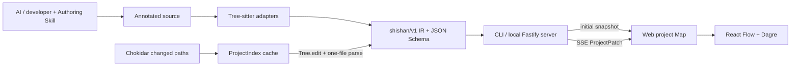

# ShiShan

ShiShan 是一套“代码叙事协议 + 本地解析器 + Web 可视化工具”。AI 在写代码时留下结构化自然语言说明，ShiShan 用真实 AST 校验这些说明绑定到哪个函数、分支、循环或具体语句，再把结果展示成可逐层展开的流程图。

当前分支已经实现 PRD 的 Phase 0–2 技术基线，支持：

- Python；
- C++；
- TypeScript 与 TSX；
- JavaScript 与 JSX；
- `function`、`step`、`branch`、`loop` 主流程节点；
- 默认隐藏、按需展开的 `detail` 实现细节；
- CLI 扫描、校验、JSON 导出和本地 Web 服务；
- 文件级监听、Tree-sitter 增量解析和 SSE 差量补丁；
- 可独立安装的 ShiShan Authoring Skill。

## 快速体验

需要 Node.js 24。

```bash
npm ci
npm run build
node apps/cli/dist/main.js scan fixtures/polyglot
node apps/cli/dist/main.js check fixtures/polyglot --strict
node apps/cli/dist/main.js serve fixtures/polyglot
```

浏览器打开 [http://127.0.0.1:4173](http://127.0.0.1:4173)。页面首次获取完整项目快照，之后只接收发生变化的文件补丁。

## 注释长什么样

```python
# @shishan function calculate-order
# @summary Calculate a normalized order total
# @input raw item prices
# @output discounted total
def calculate_order(prices):
    # @shishan detail normalize-prices
    # @summary Materialize prices and calculate the subtotal
    # @covers statements=2
    prices = list(prices)
    total = sum(prices)

    # @shishan branch apply-discount
    # @summary Apply a discount to sufficiently large orders
    # @condition total is at least 100
    if total >= 100:
        total *= 0.9

    # @shishan step return-total
    # @summary Return the final numeric total
    return total
```

`detail` 默认绑定下一条 AST 语句。`@covers statements=2` 表示连续两条同层语句；它会作为函数或流程节点上的实现说明出现，不会制造新的流程节点或边。

完整规范见 [docs/protocol.md](docs/protocol.md)，四语言可运行样例见 [fixtures/polyglot](fixtures/polyglot)。

## CLI

| 命令 | 作用 |
| --- | --- |
| `shishan init [root]` | 创建默认 `.shishanrc.json`，已有文件不会覆盖 |
| `shishan scan [root] [--json]` | 扫描项目并输出覆盖率、诊断和解析统计 |
| `shishan check [root] [--strict]` | 校验语法和绑定；`--strict` 将 warning 作为失败 |
| `shishan export [root] [--out file]` | 导出符合 JSON Schema 的完整 IR |
| `shishan serve [root] [--port 4173]` | 启动仅监听 loopback 的本地 Web 服务和增量监听 |

在本仓库中可以用 `npm run shishan -- <command>` 代替全局命令。

## Authoring Skill

Skill 位于 [skills/shishan-author](skills/shishan-author)。将该目录安装到 AI 编程工具的 skills 目录后，可以这样调用：

```text
Use $shishan-author to implement this change and keep the code narrative aligned.
```

Skill 会要求代理：

- 在实现前读取附近叙事；
- 只在有意义的语义边界加节点；
- 代码行为变化时同步更新说明；
- 重新计算 `detail` 的覆盖语句数；
- 完成后运行 `shishan check`。

## 架构



核心实现分为：

- [packages/protocol](packages/protocol)：协议类型、注释语法和 Draft 2020-12 JSON Schema；
- [packages/core](packages/core)：四语言适配、AST 绑定、Golden IR 和增量项目索引；
- [apps/cli](apps/cli)：命令行、本地 HTTP/SSE 服务和文件监听；
- [apps/web](apps/web)：项目/函数浏览、流程图、诊断、`detail` 展开和源码定位；
- [skills/shishan-author](skills/shishan-author)：AI 生产者规则。

详细数据流与安全边界见 [docs/architecture.md](docs/architecture.md)。

## 为什么更新不会重建整棵树

一次源码变化经过以下路径：

1. Chokidar 只提交变更路径，并把 75 ms 内的事件合并；
2. 未变化的内容哈希直接跳过；
3. 同语言文件使用上一棵 Tree-sitter tree 和最小文本 edit 做增量 parse；
4. 项目索引只替换该文件对象，并用加减法更新覆盖率累计值；
5. 服务只发送 `upsertFiles` 和 `removedFiles`；
6. 浏览器 Map 只替换补丁中的文件，未变化文件保持对象身份。

本机 250 文件基准的一次观测结果：初始化 138.24 ms，单文件更新 0.64 ms，复用 249 个文件；补丁 1,984 bytes，为初始快照的 0.50%。这只是回归基线，不是跨机器性能承诺。运行：

```bash
npm run benchmark:incremental -- --files=250
```

## 测试与构建

```bash
npm test
npm run build
npm run typecheck
python3 /path/to/skill-creator/scripts/quick_validate.py skills/shishan-author
```

测试覆盖协议、Schema、四语言 Golden IR、增量对象复用、资源上限、路径隔离、服务补丁和 Web 状态合并。GitHub Actions 在 Linux、macOS、Windows 的 Node 24 环境运行测试和构建；远端结果需要分支推送后确认。

验证记录见 [docs/validation.md](docs/validation.md)。

## 主要第三方依赖

| 依赖 | 用途 | 许可证 |
| --- | --- | --- |
| Tree-sitter 与四语言 grammar | 容错 AST 与增量解析 | MIT |
| Ajv | JSON Schema 校验 | MIT |
| Fastify / Chokidar | 本地服务与文件监听 | MIT |
| React / React Flow | Web UI 与流程图 | MIT |
| Dagre | 自动图布局 | MIT |
| Vite / Vitest | Web 构建与测试 | MIT |

依赖版本锁定在 [package-lock.json](package-lock.json)。Vite 构建会生成第三方许可证汇总。

## 旧原型

仓库原来的 VS Code Python 折叠实验仍保留在 [src](src) 和 `scripts/smoke-test.js`，用于追溯“隐藏实现、保留叙事线索”的早期交互想法。它不是当前架构的核心，也不会限制 Web 和多语言路线。

## 文档

- [产品需求文档](docs/PRD.md)
- [协议规范](docs/protocol.md)
- [技术架构](docs/architecture.md)
- [Phase 0–2 验证记录](docs/validation.md)
- [MIT License](LICENSE.md)
