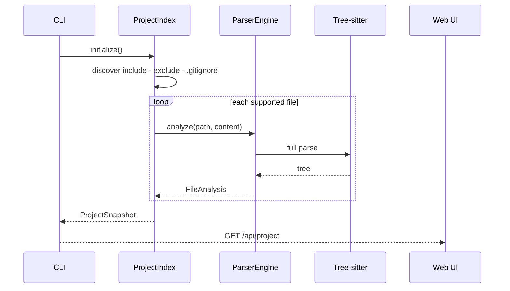
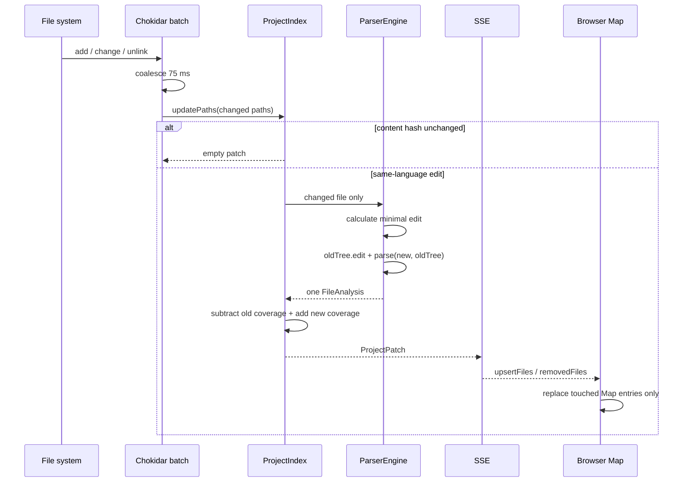
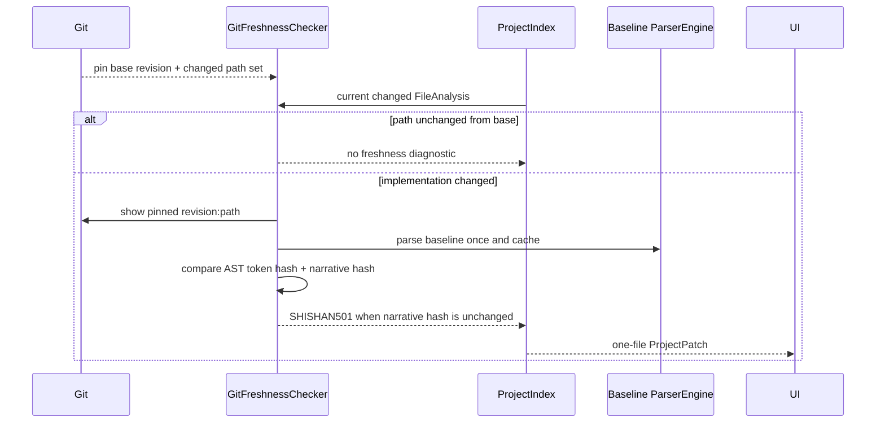

# ShiShan 技术架构

## 1. 组件边界

| 组件 | 职责 | 不负责 |
| --- | --- | --- |
| `packages/protocol` | 注释 parser、TypeScript IR、JSON Schema | 读取项目文件 |
| `packages/core` | 语言识别、Tree-sitter、AST 绑定、项目索引、Git freshness | HTTP 和 UI |
| `apps/cli` | CLI、Fastify、SSE、Chokidar、静态站点导出 | 执行被分析代码 |
| `apps/web` | 项目 Map、流程图、源码/诊断视图、live/static 启动 | 扫描本机文件系统 |
| `apps/vscode` | Linux VS Code 命令、CLI 子进程生命周期、受限源码 URI 跳转 | 复制 parser 或 Web UI |
| `skills/shishan-author` | 约束 AI 创建和维护叙事 | 代替 parser 验证 |

## 2. 首次扫描

首次快照必然包含全项目，这是建立客户端基线所需的唯一全量路径。

## 3. 在线增量路径

关键不变量：

1. watcher 不触发全项目 scan；
2. 未变化内容不调用 parser；
3. 相同语言的已缓存文件使用 Tree-sitter incremental tree；
4. 覆盖率用 accumulator 加减，不遍历重算所有 AST；
5. SSE 更新不含 `files` 全量字段；
6. 浏览器保留未变化 `FileAnalysis` 的对象身份；
7. generation 过期或重复补丁被客户端忽略；
8. 断线重连发现 generation 缺口时，客户端才重新获取一次快照。

## 4. Git 叙事过期检测

实现指纹遍历函数语法树的全部 token，忽略 comment node 和格式空白，因此普通注释、缩进或空格变化不会误报；标识符、运算符与字面量变化都会改变指纹。叙事指纹只包含稳定的 id、kind、summary、fields、children 和 details，不包含行号。

Git 基线在启动时解析为固定 commit hash，避免运行过程中 `HEAD` 移动导致同一会话使用两套基线。首次只执行一次 changed-path 查询；live update 每个 75 ms 事件批次只查询批次路径；baseline 源码和 AST 按文件缓存。新增文件没有基线，不会被误判为过期。

`SHISHAN501` 是保守启发式：它能发现“实现变了、叙事完全没变”，但不能证明一次文字修改在语义上一定正确。

## 5. AST 适配

四种产品语言映射到六个文件方言：

- Python；
- C++；
- TypeScript；
- TSX；
- JavaScript；
- JSX。

适配器声明 function、statement、branch、loop、call、error 和 async node type 集合。公共 analyzer 完成：

- 注释 token 化和协议解析；
- 同缩进下一 AST 节点绑定；
- 命名函数和 arrow function 识别；
- 最小包含范围的层级归属；
- `detail` sibling span；
- 叙事 edge；
- symbol、coverage 和 diagnostics。

语言 grammar 被锁定到共同兼容的 Tree-sitter Node ABI，避免同一进程加载不兼容 native binding。

## 6. 静态站点导出

`export-site` 先构建单次 `ProjectSnapshot`，再把 Vite 产物和 `shishan-data.js` 写入输出目录旁的随机临时目录，全部成功后通过 rename 发布。已有目标目录不会被覆盖，因此失败导出不会留下半成品。

Web 启动时优先读取 `globalThis.__SHISHAN_STATIC__`；存在时不请求 `/api/project`、`/api/events` 或 `/api/source`。静态包仍需任意普通静态 HTTP server，但不需要 ShiShan 进程、Git 或模型 API。

源码遵循显式披露：默认 payload 只有 IR；`--include-source` 才读取索引内、非符号链接的源码。源码部分上限为 25 MiB，最终 data payload 上限为 64 MiB。

## 7. 资源边界

- 默认排除 `.git`、`node_modules`、`dist`、`build` 和 `.shishan`；
- 同时尊重项目 `.gitignore`；
- 初始 glob 和在线 watcher 都不跟随符号链接；源码 API 再次检查 lstat 与 realpath；
- 单文件上限 2 MiB，超限文件返回 `SHISHAN002`，不进入 Tree-sitter；
- 文件按确定顺序解析，避免无界并发 native parse；
- watcher 事件合并 75 ms；
- SSE 20 秒 heartbeat 不携带项目树；
- Web 源码面板只渲染选中范围前后少量上下文。
- 80 个节点以上才动态加载 ELK Worker；单次布局最多 600 个节点、5 秒，失败回退 Dagre；
- freshness 初始只读取 Git changed-path 列表，后续只查询 watcher 批次路径；
- 每个 Git baseline 文件最多解析一次并缓存 AST；
- 静态导出源码默认关闭，启用后总量不超过 25 MiB；
- 最终静态 data payload 不超过 64 MiB；
- production Web 不生成 source map，避免静态分享携带约 1.7 MiB 的非运行时数据。

`scripts/benchmark-incremental.mts` 同时断言：

- 只解析被修改文件；
- 未修改文件对象未替换；
- patch 只包含一个 upsert；
- 输出 patch 与 snapshot 的字节比例。

## 8. VS Code 与批量注释边界

VS Code 扩展不嵌入第二套解析器。`Open Code Narrative` 通过参数数组启动现有 CLI loopback server，再交给 VS Code Simple Browser；`Check Narrative Freshness` 同样直接运行 CLI strict check。Web 的编辑器链接使用 `vscode://zhyma.shishan-vscode/open`，URI Handler 重新做 workspace-relative 归一化、存在性检查和一基/零基坐标转换，不接受任意绝对文件。

批量注释拆为两个显式阶段：

1. `annotate-plan` 只列出无叙事函数、稳定候选 ID、源码位置与内容哈希，`summary` 保持 `null`、`status` 保持 `draft`；
2. 用户填写事实性 summary 并改为 `approved` 后，`annotate-apply` 先统一验证所有文件；默认只 dry-run，`--write` 才逐文件用 sibling 临时文件和 rename 替换。

应用前会重新检查内容 hash、函数名和位置、插入行、ID、字段单行性、完整输出语法和 AST 绑定。预验证任何一步失败都发生在首次 source rename 之前，避免因为仓库已变化而出现部分写入。

## 9. 安全边界

- 只允许 `127.0.0.1`、`localhost` 或 `::1` 监听；
- Host 和 Origin 必须是 loopback；
- 源码 API 使用 root-relative 归一化并拒绝目录穿越；
- 只读取已支持的源码扩展名；
- 不 import、编译或执行被分析项目；
- 不上传源码、无遥测、无模型 API；
- React 默认转义注释文本；
- 响应带 CSP、`nosniff` 和 `no-referrer`。
- Git 通过 `execFile` 参数数组调用，不经过 shell；基线 revision 在启动时固定；
- 静态导出不覆盖已有目录，默认不包含目标仓库源码。
- VS Code URI 只打开当前 workspace 内已存在文件；扩展和 CLI 均不经过 shell；
- annotation plan 路径和其中的 source path 必须留在项目根目录，draft/skip 永不写入，summary 和字段不能注入换行。

## 10. 已知技术边界

- v1.1 edge 是面向理解的叙事关系，不是完整 CFG；
- C++ 不进行预处理器展开、模板实例化或编译数据库语义解析；
- Unicode edit 使用 UTF-8 byte position 交给 Tree-sitter，Golden 测试仍需继续扩充复杂 Unicode 边界；
- 大型项目首次快照仍与项目规模线性相关；单函数超过 600 个叙事节点时 Web 显式截断；
- Web 暂不提供跨函数调用图；
- freshness 暂不跨 Git rename 关联旧路径，也不证明修改后的叙事语义正确；
- 当前交付与 CI 只面向 Linux，macOS 和 Windows 已按产品决策延期；
- 静态导出需要普通 HTTP 静态托管，不能保证浏览器直接用 `file://` 打开 ES module。
