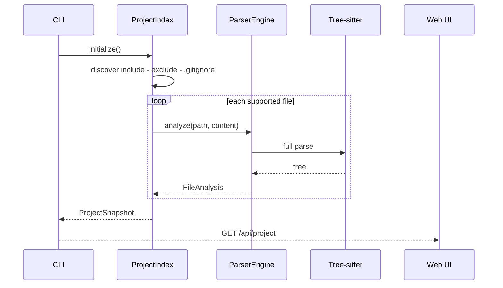
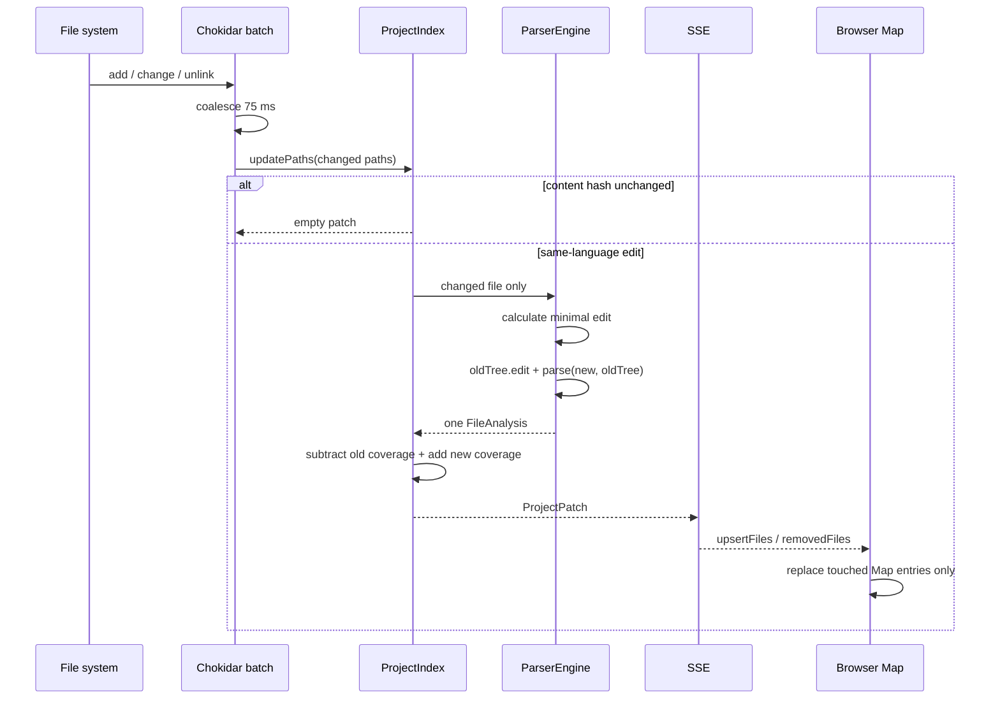

# ShiShan 技术架构

## 1. 组件边界

| 组件 | 职责 | 不负责 |
| --- | --- | --- |
| `packages/protocol` | 注释 parser、TypeScript IR、JSON Schema | 读取项目文件 |
| `packages/core` | 语言识别、Tree-sitter、AST 绑定、项目索引 | HTTP 和 UI |
| `apps/cli` | CLI、Fastify、SSE、Chokidar | 执行被分析代码 |
| `apps/web` | 项目 Map、流程图、源码/诊断视图 | 扫描本机文件系统 |
| `skills/shishan-author` | 约束 AI 创建和维护叙事 | 代替 parser 验证 |

## 2. 首次扫描

首次快照必然包含全项目，这是建立客户端基线所需的唯一全量路径。

## 3. 在线增量路径

关键不变量：

1. watcher 不触发全项目 scan；
2. 未变化内容不调用 parser；
3. 相同语言的已缓存文件使用 Tree-sitter incremental tree；
4. 覆盖率用 accumulator 加减，不遍历重算所有 AST；
5. SSE 更新不含 `files` 全量字段；
6. 浏览器保留未变化 `FileAnalysis` 的对象身份；
7. generation 过期或重复补丁被客户端忽略；
8. 断线重连发现 generation 缺口时，客户端才重新获取一次快照。

## 4. AST 适配

四种产品语言映射到六个文件方言：

- Python；
- C++；
- TypeScript；
- TSX；
- JavaScript；
- JSX。

适配器声明 function、statement、branch 和 loop node type 集合。公共 analyzer 完成：

- 注释 token 化和协议解析；
- 同缩进下一 AST 节点绑定；
- 命名函数和 arrow function 识别；
- 最小包含范围的层级归属；
- `detail` sibling span；
- 叙事 edge；
- symbol、coverage 和 diagnostics。

语言 grammar 被锁定到共同兼容的 Tree-sitter Node ABI，避免同一进程加载不兼容 native binding。

## 5. 资源边界

- 默认排除 `.git`、`node_modules`、`dist`、`build` 和 `.shishan`；
- 同时尊重项目 `.gitignore`；
- 初始 glob 和在线 watcher 都不跟随符号链接；源码 API 再次检查 lstat 与 realpath；
- 单文件上限 2 MiB，超限文件返回 `SHISHAN002`，不进入 Tree-sitter；
- 文件按确定顺序解析，避免无界并发 native parse；
- watcher 事件合并 75 ms；
- SSE 20 秒 heartbeat 不携带项目树；
- Web 源码面板只渲染选中范围前后少量上下文。

`scripts/benchmark-incremental.mts` 同时断言：

- 只解析被修改文件；
- 未修改文件对象未替换；
- patch 只包含一个 upsert；
- 输出 patch 与 snapshot 的字节比例。

## 6. 安全边界

- 只允许 `127.0.0.1`、`localhost` 或 `::1` 监听；
- Host 和 Origin 必须是 loopback；
- 源码 API 使用 root-relative 归一化并拒绝目录穿越；
- 只读取已支持的源码扩展名；
- 不 import、编译或执行被分析项目；
- 不上传源码、无遥测、无模型 API；
- React 默认转义注释文本；
- 响应带 CSP、`nosniff` 和 `no-referrer`。

## 7. 已知技术边界

- v1 edge 是面向理解的叙事关系，不是完整 CFG；
- C++ 不进行预处理器展开、模板实例化或编译数据库语义解析；
- Unicode edit 使用 UTF-8 byte position 交给 Tree-sitter，Golden 测试仍需继续扩充复杂 Unicode 边界；
- 大型项目首次快照仍与项目规模线性相关；
- Web 暂不提供跨函数调用图；
- 远端三系统 CI 只有在分支推送后才能给出实际 runner 结果。
